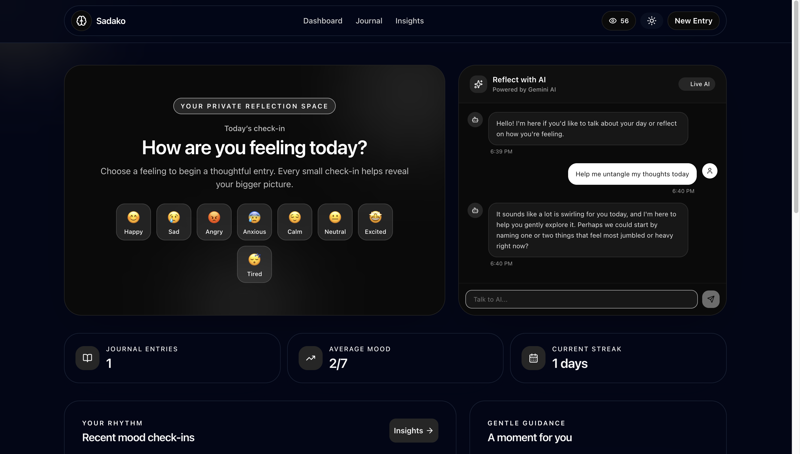

# Sadako 



A smart journaling application with AI-powered mood tracking and sentiment analysis.

## Features

- **Journal Entries**: Write and manage your daily thoughts
- **Mood Tracking**: Log your mood with emojis and intensity
- **AI Insights**: Get personalized insights and recommendations
- **Analytics**: Visualize your mood patterns and trends
- **Sentiment Analysis**: AI-powered text analysis
- **Responsive**: Works on all devices
- **Local Storage**: All data stored locally

## Tech Stack

- React 18
- TypeScript
- Vite
- Tailwind CSS
- Zustand (State Management)
- React Router v6
- Lucide Icons
- date-fns
- Supabase (Backend/Auth)
- Gemini AI (Insights & Analysis)

## Step-by-Step Setup Guide

Follow these instructions to get Sadako running on your local machine.

### 1. Prerequisites

Before you begin, ensure you have the following installed:
- [Node.js](https://nodejs.org/) (Version 16 or higher)
- npm or yarn

### 2. Clone the Repository

Clone the project to your local machine and navigate into the project directory:

```bash
git clone https://github.com/yourusername/sadako.git
cd sadako
```

### 3. Install Dependencies

Install all required npm packages:

```bash
npm install
```

### 4. Environment Configuration

Sadako requires a few environment variables to connect to its backend services (Supabase and Gemini AI). 

Create a `.env` file in the root directory of your project:

```bash
touch .env
```

Open the `.env` file and add the following keys. Replace the placeholder values with your actual API keys:

```env
VITE_SUPABASE_URL=your_supabase_url_here
VITE_SUPABASE_ANON_KEY=your_supabase_anon_key_here
VITE_GEMINI_API_KEY=your_gemini_api_key_here
```

### 5. Start the Development Server

Once your environment variables are configured, start the app in development mode:

```bash
npm run dev
```

### 6. Open the App

Open your browser and navigate to the local server address provided in your terminal (usually [http://localhost:5173](http://localhost:5173)). 

## Building for Production

To create a production-ready build of the application:

```bash
npm run build
```

To preview the production build locally:

```bash
npm run preview
```

## Project Structure

```
src/
├── components/     # Reusable components
│   ├── ui/        # UI primitives
│   ├── layout/    # Layout components
│   ├── journal/   # Journal components
│   ├── mood/      # Mood components
│   └── ai/        # AI components
├── pages/          # Page components
├── store/          # Zustand stores
├── hooks/          # Custom hooks
├── utils/          # Utility functions
├── types/          # TypeScript types
└── ...             # Config files
```

## Contributing

1. Fork the repository
2. Create your feature branch (`git checkout -b feature/AmazingFeature`)
3. Commit your changes (`git commit -m 'Add some AmazingFeature'`)
4. Push to the branch (`git push origin feature/AmazingFeature`)
5. Open a Pull Request

## License

This project is licensed under the MIT License.

## Acknowledgments

- Built with React and TypeScript
- Icons by Lucide
- Styling with Tailwind CSS
